# SellOut International - Data Processing to Global Partners (EN-US)

## ❕™️ Disclaimer
**PT-BR**:
Este documento contém scripts em Python e consultas do BigQuery utilizados no projeto. Todos os exemplos, códigos e consultas são puramente ilustrativos e destinam-se apenas a fins de documentação. Qualquer semelhança com dados reais é puramente coincidência.

Por favor, note que o acesso aos sistemas e dados reais requer autorização e concessão de acesso específica. Não é permitido o acesso não autorizado ou o uso não autorizado de quaisquer informações ou sistemas.

**EN-US:**
This document contains Python scripts and BigQuery queries used in the project. All examples, code snippets, and queries are purely illustrative and intended for documentation purposes only. Any resemblance to real data is purely coincidental.

Please note that access to actual systems and data requires specific authorization and access grants. Unauthorized access or unauthorized use of any information or systems is strictly prohibited.

**ES-CO:**
Este documento contiene scripts de Python y consultas de BigQuery utilizadas en el proyecto. Todos los ejemplos, fragmentos de código y consultas son puramente ilustrativos y están destinados únicamente a fines de documentación. Cualquier parecido con datos reales es pura coincidencia.

Por favor, tenga en cuenta que el acceso a sistemas y datos reales requiere autorización específica y concesiones de acceso. El acceso no autorizado o el uso no autorizado de cualquier información o sistemas está estrictamente prohibido.

# 🎯 Project Objectives

Improve SellOut data processing for LATAM countries and later for others, ensuring efficient updating, data security, low processing costs and effective visualization of results.

# 🗒️ General Vision

**Sponsors:** Felipe Sartori, Matthieu Battard

**Manager:** [Andre Waleczki](https://www.linkedin.com/in/andre-waleczki/)

**Start date:** 04/09/2023

**Deadline executed:** 05/10/2023

**Technology used:** *Excel Files, Google Colab, Google Drive, Google Sheets, Google BigQuery, DataPrep by Trifacta and Looker Studio.*

# 📋 Project Architecture:

The entire project was carried out using pre-existing data processing structures, we organized new folders as the source of the files and created a new Python script that queries some Big Query tables and overwrites the processed data in a table from project ssbx-hidden-information' and a migration to the 'ssbx-hidden-information2' project is planned. Below is the initial project diagram:

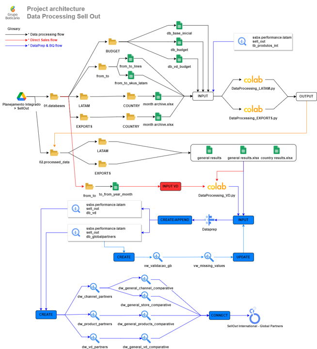

# ☑️ Requirements

* **Users who will run the script**: Must have access and have accessed at least once all the files that are consumed by the script. Replace the current month's file in the "Historic" folder for each country.

* **Users who will consume the data in Looker**: Must have reader access to the BigQuery table for the data to be loaded.

# 🧾 Execution suggestion:
Run only after allocating the files correctly in the folders and processing step by step as explained below.

## Automation Flow - Sell Out:
To run the following script, the files for the month in which you will update the data must be in the destination folder for each country as in the example below:

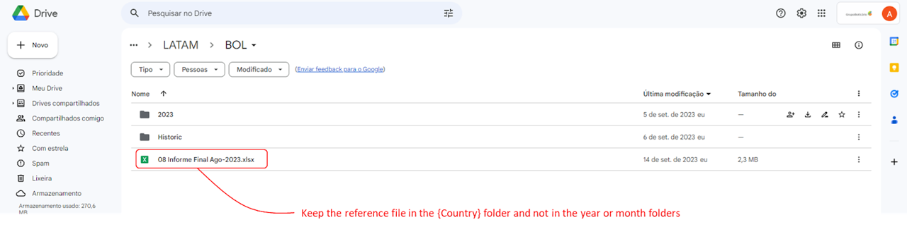

* The file name **does not matter** as long as it is in the correct destination (the same applies for all countries)

The *DataProcessing_LATAM.py* and *DataProcessing_EXPORTS.py* scripts read the files shown in the diagram, perform the necessary data processing to standardize data from different countries and clean up null or non-existent data, keeping only the table pattern defined for data loading from Dataprep/ BigQuery and stores the results directly in the Google Sheets files below:

* **general_results_LATAM**

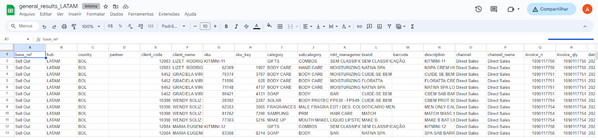

* **general_results_EXPORTS**

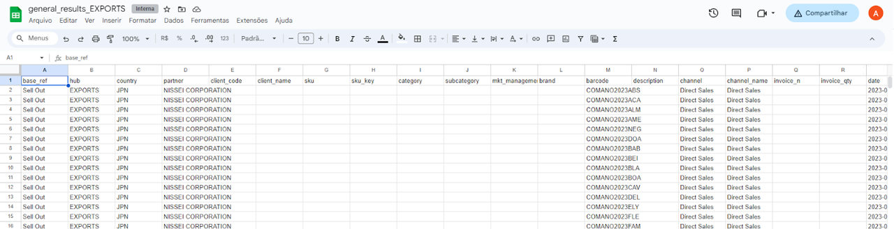

and after that, run the Dataprep Global Partners import service to export data from the Google Sheets file directly to the BigQuery table `ssbx-hidden-information.sell_out.db_globalpartners`. 

* **Dataprep** Global Partners: Dataprep is configured to convert the Excel column type to the acceptable BigQuery format and import it into the reference or creation table if it does not exist.

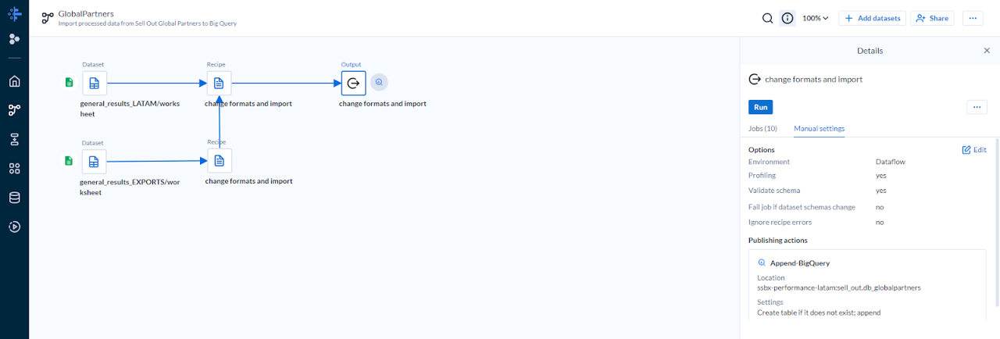

*You need to right click on dataset and click on refresh to update the file in dataprep*

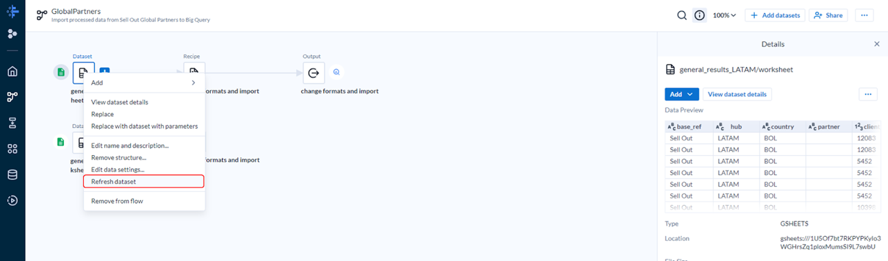

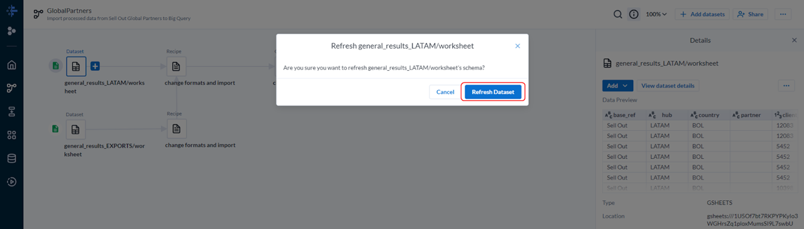

Click  to import data to BigQuery.

* **BigQuery** Table: Here we maintain the history and the base consumed by the views to bring the updated data to the Dashboard.

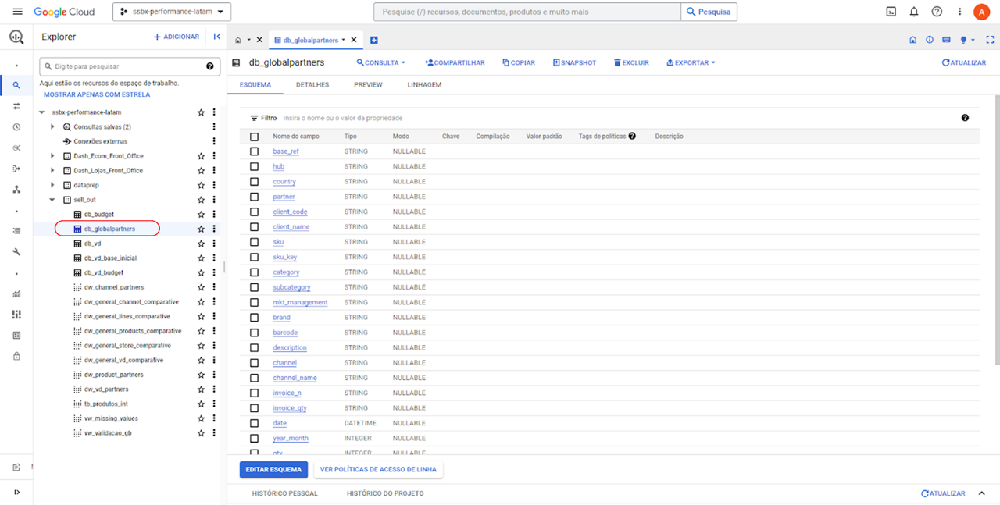

With the updated BigQuery table, the SQL views related to the table are automatically updated with newer data, and this in turn is reflected in the **General Results Dashboard - Global Partners**

# ☠️ Important information
As the months and years go by, it is common for some channels, categories, etc. to have changes or discontinuations. However, in our views, we consume comparisons comparing the relevant indicators to the Dashboard views, and despite having the previous year's data in the base, they are not included in the annual comparisons. So that we do not see missing data under any circumstances, the views *vw_validacao_gb* and *vw_missing_values* were created.

After updating the current month's data, run the process in **Dataprep Missing Comparative - Global Partners** to import a data mirror that has results from the previous year, but which does not continue in the current year, so that the results are added together and we do not lose visibility of the results:

* **Missing Comparative - Global Partners**

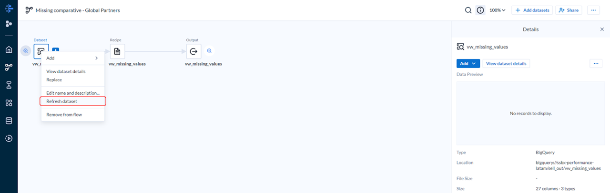

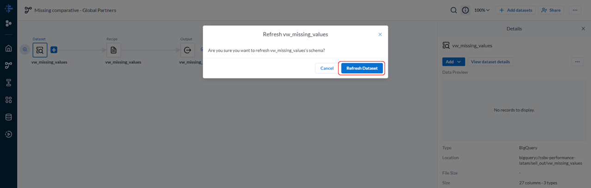

Click  to import data to BigQuery.

## Automation Flow - Direct Sales:

With the Sell Out automation process updated, we can run the script *DataProcessing_VD.py* which crosses the historical base of the month desired from `ssbx-hidden-information.sell_out.db_globalpartners` for updating and updates its status according to the business rules established in the Script, after execution the results are exported to a Google Sheets file below:

* **general_results_VD**

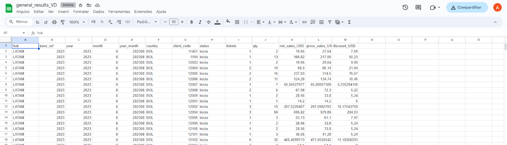

and after that, run the Dataprep VD import service to export data from the Google Sheets file directly to the BigQuery table `ssbx-hidden-information.sell_out.db_vd`. 

* **Dataprep VD**: Dataprep is configured to convert the Excel column type to the acceptable BigQuery format and import it into the reference or creation table if it does not exist.

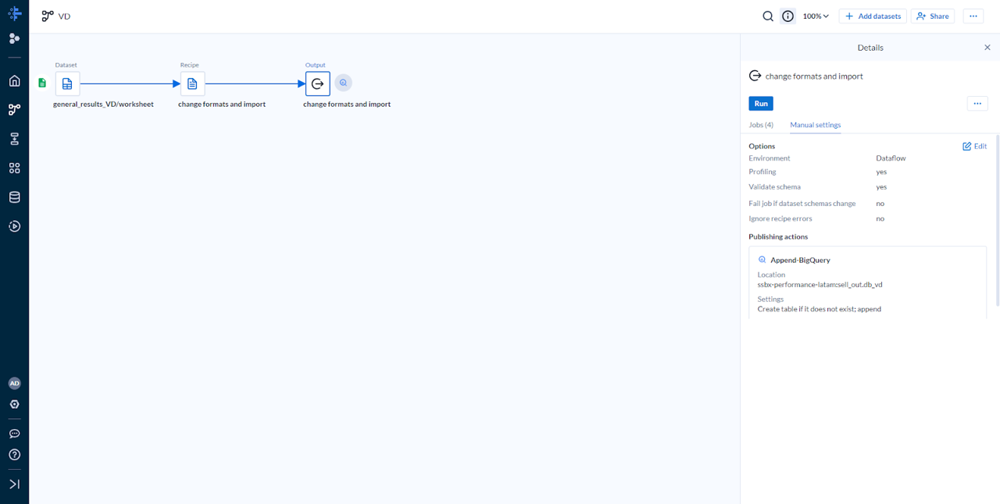

*You need to right click on dataset and click on refresh to update the file in dataprep*

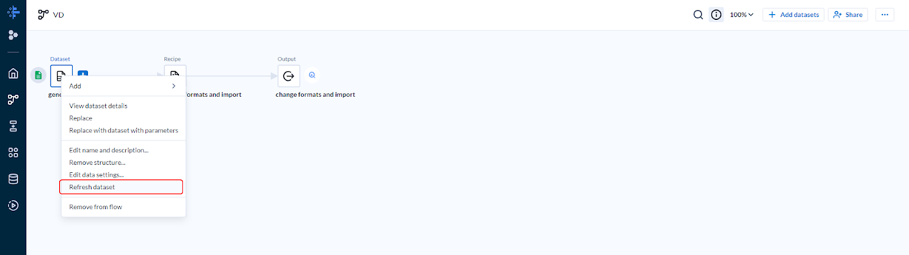

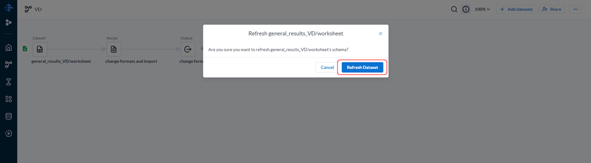

Click  to import data to BigQuery.

* **BigQuery Table VD**: Here we maintain the history and the base consumed by the views to bring the updated data to the Dashboard.

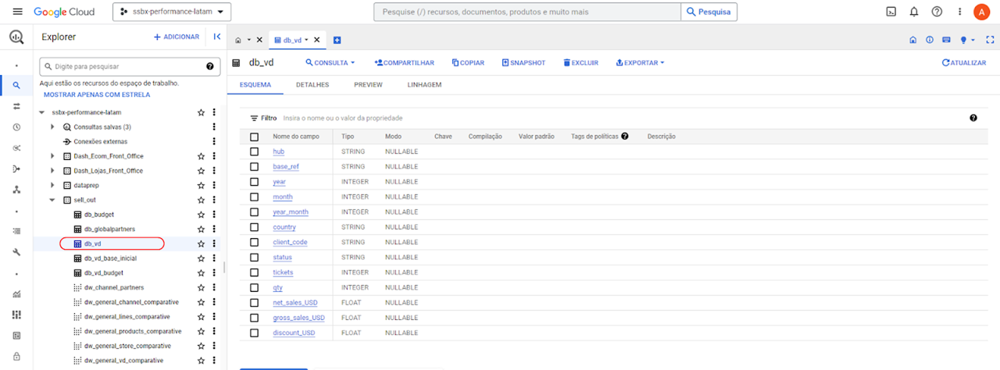

With the updated BigQuery table, the SQL views related to the table are automatically updated with newer data, and this in turn is reflected in the **General Results Dashboard - Global Partners**

# ⚙️ Maintenance and Support:

The errors expected for future executions are the non-previous change of layout, format and column names of the files used as references in the code. If the code does not execute correctly, the remaining import and export steps through **DataPrep** and **Google BigQuery** are not executed. Be careful if you encounter any errors while executing the script.

# ❌ In Case of Errors:
**We only have three possibilities**: *Invalid data*, *changing the name of the columns* or *changing the name of the spreadsheet*. The file name is obtained automatically through the Script but we are unable to do the same with the spreadsheet name.

In addition to the errors mentioned above, we have a problem in relation to comparisons in views, if the current *year_month* has a reference to parents, hub, channel, channel_name, category, brand that exists in the previous year, but not in the current year (or vice and verse) the data is not included in results comparisons. That's why we created the views *vw_missing_value*s and *vw_validacao_gb*, which validates these missing values that will generate problems in comparisons and aggregates them in the *db_global_partners* format through DataPrep

# Tables:
## db_global_partners

Table that stores the raw data processed only with SKU and rename crossings in the columns of the files received by partners in each country. It is also the reference for all stages of the project in relation to output.

### Schema

| fullname | type | description |
|---------:|-----:|------------:|
| base_ref | STRING | Reference of the year |
| hub | STRING | Hub reference which is a country location |
| country | STRING | Country reference |
| partner | STRING | Partner name |
| client_code | STRING | Customer code |
| client_name | STRING | Client name |
| sku | STRING | SKU code |
| sku_key | STRING | Key Code |
| category | STRING | Category name |
| subcategory | STRING | Subcategory name |
| mkt_management | STRING | Brand Management |
| brand | STRING | Brand name |
| barcode | STRING | Barcode |
| description | STRING | Product Description |
| channel | STRING | Sales channel |
| channel_name | STRING | Channel name |
| invoice_n | STRING | Sales code |
| invoice_qty | STRING | Sales count |
| date | DATETIME | Date |
| year_month | INTEGER | Reference of the year & month merge |
| qty | INTEGER | Sales quantity |
| discount_USD | FLOAT | Discount applied |
| gross_sales_USD | FLOAT | Gross sales |
| net_sales_USD | FLOAT | Liquid sales |
| product_line | STRING | Olfactory product line |
| director_code | STRING | Director's code |
| director_name | STRING | Director's name |

## db_vd

Table that stores the processed Direct Sales data on a monthly basis, the script searches the previous month's results directly in this table, comparing with the current month's results in the db_global_partners table and updating the sellers' status according to the current month's results.

### Schema

| fullname | type | description |
|---------:|-----:|------------:|
| hub | STRING | Hub reference which is a country location |
| base_ref | STRING | Reference of the year |
| year | INTEGER | Reference of the year |
| month | INTEGER | Reference of the month |
| year_month | INTEGER | Reference of the year & month merge |
| country | STRING | Country reference |
| client_code | STRING | Customer code |
| status | STRING | Partner status for the month |
| tickets | INTEGER | Count of sales |
| qty | INTEGER | Count of products selled |
| net_sales_USD | FLOAT | Liquid sales |
| gross_sales_USD | FLOAT | Gross sales |
| discount_USD | FLOAT | Discount applied |

## db_budget

Table replicated from a Google Sheets file, which contains Budget data by country and channel for Sell Out. As it is an integrated file, any layout change in the Google Sheets file may result in errors in the table, only updating is recommended incremental goals and in case of layout changes, reimporting the table is recommended.

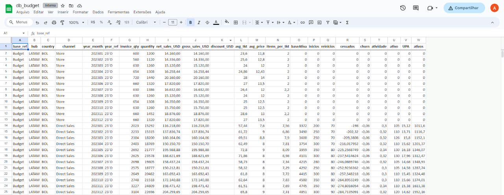

## db_vd_base_inicial

Table replicated from a Google Sheets file, which contains initial baseline data by country and month for VD. As it is an integrated file, any layout change in the Google Sheets file may result in errors in the table, only updating is recommended for incremental purposes and in case of layout changes it is recommended to reimport the table.

* The file is integrated with a connection via Query in the db_vd table to obtain the number of assets, starts and restarts and calculate the initial base in the file itself. In yellow are the columns that are imported into BigQuery.

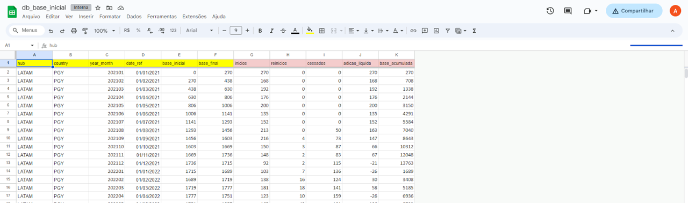

## db_vd_budget

Table replicated from a Google Sheets file, which contains Budget data by country for VD. As it is an integrated file, any layout change in the Google Sheets file may result in errors in the table, only updating is recommended incremental goals and in case of layout changes, reimporting the table is recommended.

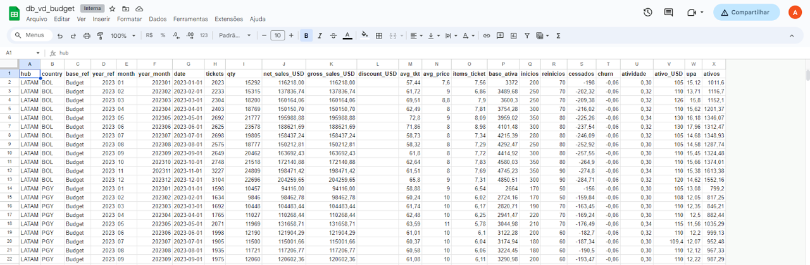

# 🔎 Query

## base_inicial

To obtain the initial base data and calculate the monthly accumulations by country, we use a Google Sheets file called db_base_initial, which runs the query below in dw_vd_partners to obtain the count of starts, restarts, stops and calculates the net addition.

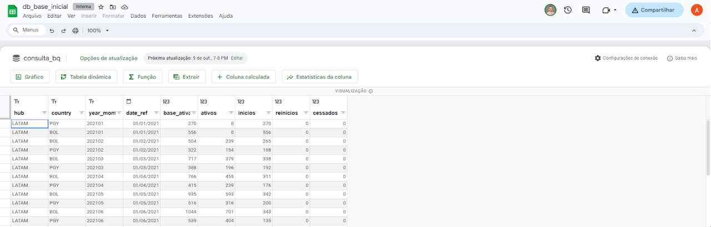

```sql
select 
bvd.hub,
bvd.country,
bvd.year_month,
bvd.date_ref,
count(case when bvd.status in ('A0','Início','Reinício') then 1 else null end) as base_ativa,
count(case when bvd.status in ('A0') then 1 else null end) as ativos,
count(case when bvd.status in ('Início') then 1 else null end) as inicios,
count(case when bvd.status in ('Reinício') then 1 else null end) as reinicios,
count(case when bvd.status in ('Cessado') then 1 else null end) as cessados
from ssbx-hidden-information.sell_out.dw_vd_partners as bvd
group by bvd.hub, bvd.country, bvd.year_month, bvd.date_ref;
```

# 🔎 Views

In order for the final file to have the same views and comparisons that existed in the original Excel file, we needed to structure the Views in BigQuery, as shown in below:


## dw_channel_partners
View created to group results by channel and channel_name, also creates a column for the first day of the month so that period filters work properly without allowing unfiltered days of the month to be left out of the selection. We also applied a rule to remove the 'Employee Sales' channel as advised by the business team.

```sql
select 
gp.country,
gp.hub,
gp.channel,
gp.channel_name,
count(distinct gp.invoice_n) as invoice_qty,
gp.year_month,
date(timestamp(concat(substr(cast(year_month as string), 1, 4), '-', substr(cast(year_month as string), 5, 2), '-01'))) as first_day_of_month,
sum(gp.net_sales_USD) as net_sales_USD,
sum(gp.gross_sales_USD) as gross_sales_USD,
sum (gp.qty) as qty,
from `ssbx-hidden-information.sell_out.db_globalpartners` as gp
where gp.channel not in ('Employee Sales') 
group by gp.country, gp.hub, gp.channel, gp.channel_name, year_month, first_day_of_month;
```
## dw_general_channel_comparative
View created on the dw_channel_partners view with a variable comparison criterion with the results of the previous period, also bringing the Budget into the view and filtering the current year and the previous year.

```sql
with sales_data as (
select
cast(extract(year from cp.first_day_of_month) as string) as base_ref,
cp.hub,
cp.country,
cp.channel,
cp.channel_name,
cp.first_day_of_month as date_ref,
sum(cp.gross_sales_USD) as gross_sales_USD,
sum(cp.net_sales_USD) as net_sales_USD,
sum(cp.qty) as qty,
sum(cp.invoice_qty) as invoice_qty
from `ssbx-hidden-information.sell_out.dw_channel_partners` as cp
group by base_ref, cp.hub, cp.country, cp.channel, cp.channel_name,date_ref
)

select
current_year.base_ref,
current_year.hub,
current_year.country,
current_year.channel,
current_year.channel_name,
current_year.date_ref,
current_year.gross_sales_USD as current_gross,
previous_year.gross_sales_USD as previous_gross,
current_year.net_sales_USD as current_net,
previous_year.net_sales_USD as previous_net,
current_year.qty as current_qty,
previous_year.qty as previous_qty,
current_year.invoice_qty as current_invoice,
previous_year.invoice_qty as previous_invoice,
from sales_data as current_year
left join sales_data as previous_year on current_year.hub = previous_year.hub
and current_year.country = previous_year.country
and current_year.channel = previous_year.channel
and current_year.channel_name = previous_year.channel_name
and date_diff(current_year.date_ref, previous_year.date_ref, month) = 12
where (extract(year from current_year.date_ref) = extract(year from current_date) or
       extract(year from current_year.date_ref) = extract(year from current_date) - 1)

union all

select
db.base_ref,
db.hub,
db.country,
db.channel,
'' as channel_name,
date(timestamp(concat(substr(cast(db.year_month as string), 1, 4), '-', substr(cast(db.year_month as string), 5, 2), '-01'))) as date_ref,
db.gross_sales_USD as current_gross,
0 as previous_gross,
db.net_sales_USD as current_net,
0 as previous_net,
db.quantity as current_qty,
0 as previous_qty,
db.invoice_qty as current_invoice,
0 as previous_invoice
from `ssbx-hidden-information.sell_out.db_budget` as db;
```

## dw_general_store_comparative
Same view as dw_general_channel_comparative, but with channel = Store

```sql
SELECT * 
FROM `ssbx-hidden-information.sell_out.dw_general_channel_comparative`
WHERE channel = "Store";
```

## dw_product_partners
View created to group channel, category, subcategory, description, product line and brand results by year_month and country, also applying the business rules provided by the business team, which are:
channel not like "Employee Sales" and category other than 'SUPORTE À VENDA' , 'PACKAGING' , 'NOT SELLABLE PACKAGING' , 'DELIVERY' and adding a rule to bring only the last "description" case for all variations to the SKU view.

```sql
select 
gp.sku,
gp.sku_key,
gp.country,
gp.hub,
gp.channel,
gp.category,
gp.subcategory,
de.description,
gp.product_line,
gp.brand,
gp.year_month,
date(timestamp(date_trunc(gp.date, MONTH))) AS first_day_of_month,
sum(gp.net_sales_USD) as net_sales_USD,
sum(gp.gross_sales_USD) as gross_sales_USD,
sum (gp.qty) as qty,
from `ssbx-hidden-information.sell_out.db_globalpartners` as gp
left join (select des.sku_key, max(des.description) as description from `ssbx-hidden-information.sell_out.db_globalpartners` as des group by des.sku_key) as de on de.sku_key = gp.sku_key
where gp.sku_key not in ('-')
and gp.sku_key is not null
and gp.category not in ('SUPORTE À VENDA','PACKAGING','NOT SELLABLE PACKAGING','DELIVERY')
and gp.channel not in ('Employee Sales')
group by
gp.sku,
gp.sku_key,
gp.country,
gp.hub,
gp.channel,
gp.category,
gp.subcategory,
de.description,
gp.product_line,
gp.brand,
gp.year_month,
first_day_of_month
order by sku_key;
```
## dw_general_products_comparative
View similar to vw_general_channel_comparative, except for bringing the columns and comparisons related to products, and applying the period rule from January to the last month with update

```sql
with sales_data as (
select
pp.sku,
pp.sku_key,
pp.hub,
pp.country,
pp.channel,
pp.category,
pp.subcategory,
pp.product_line,
pp.brand,
pp.description,
pp.first_day_of_month,
extract(year from pp.first_day_of_month) as year,
sum(pp.gross_sales_USD) as gross_sales_USD,
sum(pp.net_sales_USD) as net_sales_USD,
sum(pp.qty) as qty
from `ssbx-hidden-information.sell_out.dw_product_partners` as pp
group by pp.sku, pp.sku_key, pp.hub, pp.country, pp.channel, pp.category, pp.subcategory, pp.product_line, pp.brand, pp.description, pp.first_day_of_month, year)

select
current_year.sku,
current_year.sku_key,
current_year.hub,
current_year.country,
current_year.channel,
current_year.category,
current_year.subcategory,
current_year.product_line,
current_year.brand,
current_year.description,
current_year.first_day_of_month,
current_year.year,
current_year.gross_sales_USD as current_gross,
previous_year.gross_sales_USD as previous_gross,
current_year.net_sales_USD as current_net,
previous_year.net_sales_USD as previous_net,
current_year.qty as current_qty,
previous_year.qty as previous_qty,
from sales_data as current_year
left join sales_data as previous_year on current_year.sku = previous_year.sku
and current_year.sku_key = previous_year.sku_key
and current_year.hub = previous_year.hub
and current_year.country = previous_year.country
and current_year.channel = previous_year.channel
and current_year.category = previous_year.category
and current_year.subcategory = previous_year.subcategory
and current_year.product_line = previous_year.product_line
and current_year.brand = previous_year.brand
and current_year.description = previous_year.description
and date_diff(current_year.first_day_of_month, previous_year.first_day_of_month, month) = 12
where (extract(year from current_year.first_day_of_month) = extract(year from current_date) and extract(month from current_year.first_day_of_month) between 1 and extract(month from current_date) - 1)
  or  (extract(year from current_year.first_day_of_month) = extract(year from current_date) - 1 and extract(month from current_year.first_day_of_month) between 1 and extract(month from current_date) - 1);
```

## dw_general_lines_comparative
View similar to vw_general_products_comparative, except for bringing the columns and comparisons related to line, category and channel, and applying the period rule from January to the last month with update

```sql
with sales_data as (
select
pp.hub,
pp.country,
pp.category,
pp.channel,
pp.product_line,
pp.first_day_of_month,
extract(year from pp.first_day_of_month) as year,
sum(pp.net_sales_USD) as net_sales_USD,
sum(pp.qty) as qty,
from `ssbx-hidden-information.sell_out.dw_product_partners` as pp
group by pp.hub, pp.country,pp.category, pp.channel, pp.product_line, pp.first_day_of_month, year)

select
current_year.hub,
current_year.country,
current_year.category,
current_year.channel,
current_year.product_line,
current_year.first_day_of_month,
current_year.year,
current_year.net_sales_USD as current_net,
previous_year.net_sales_USD as previous_net,
current_year.qty as current_qty,
previous_year.qty as previous_qty,
from sales_data as current_year
left join sales_data as previous_year on current_year.hub = previous_year.hub
and current_year.country = previous_year.country
and current_year.category = previous_year.category
and current_year.channel = previous_year.channel
and current_year.product_line = previous_year.product_line
and date_diff(current_year.first_day_of_month, previous_year.first_day_of_month, month) = 12
where (extract(year from current_year.first_day_of_month) = extract(year from current_date) and extract(month from current_year.first_day_of_month) between 1 and extract(month from current_date) - 1)
  or  (extract(year from current_year.first_day_of_month) = extract(year from current_date) - 1 and extract(month from current_year.first_day_of_month) between 1 and extract(month from current_date) - 1);
```

## dw_vd_partners
Adds a date reference column to the db_vd query so that it can be correctly consumed with the period filters.

```sql
select
hub,
base_ref,
year,
month,
cast(year_month as string) as year_month,
date(timestamp(concat(substr(cast(year_month as string), 1, 4), '-', substr(cast(year_month as string), 5, 2), '-01'))) as date_ref,
country,
client_code,
status,
tickets,
qty,
net_sales_USD,
gross_sales_USD,
discount_USD
from`ssbx-hidden-information.sell_out.db_vd`;
```

## dw_general_vd_comparative
View created on the dw_vd_partners view with a variable comparison criterion with the results of the previous period, also bringing the Budget into the view and filtering the current year and the previous year.

```sql
with sales_data as (
select 
base_ref,
bvd.hub,
bvd.country,
bvd.year_month,
bvd.date_ref,
sum(bvd.tickets) as tickets,
sum(bvd.qty) as qty,
sum(bvd.net_sales_USD) as net_sales_USD,
sum(bvd.gross_sales_USD) as gross_sales_USD,
sum(bvd.discount_USD) as discount_USD,
bi.base_inicial as base_inicial,
bi.base_final as base_final,
count(case when bvd.status in ('A0','Reinício') then 1 else null end) as base_ativa, #Ativa no ciclo
count(case when bvd.status in ('A0') then 1 else null end) as ativos,
count(case when bvd.status in ('Início') then 1 else null end) as inicios,
count(case when bvd.status in ('Reinício') then 1 else null end) as reinicios,
count(case when bvd.status in ('Cessado') then 1 else null end) as cessados
from `ssbx-hidden-information.sell_out.dw_vd_partners` as bvd
left join `ssbx-hidden-information.sell_out.db_vd_base_inicial` as bi on bi.hub = bvd.hub
and bi.country  = bvd.country
and bi.year_month  = bvd.year_month
group by base_ref,bvd.hub, bvd.country, bvd.year_month, bvd.date_ref, bi.base_inicial, bi.base_final
)

select
current_year.base_ref,
current_year.hub,
current_year.country,
cast(current_year.year_month as string) as year_month,
current_year.date_ref,
current_year.gross_sales_USD as current_gross,
previous_year.gross_sales_USD as previous_gross,
current_year.net_sales_USD as current_net,
previous_year.net_sales_USD as previous_net,
current_year.qty as current_qty,
previous_year.qty as previous_qty,
current_year.tickets as current_invoice,
previous_year.tickets as previous_invoice,
current_year.base_inicial as base_inicial,
previous_year.base_inicial as previous_base_inicial,
current_year.base_final as base_final,
previous_year.base_final as previous_base_final,
current_year.base_ativa as base_ativa,
previous_year.base_ativa as previous_base_ativa,
current_year.ativos as ativos,
previous_year.ativos as previous_ativos,
current_year.inicios as inicios,
previous_year.inicios as previous_inicios,
current_year.reinicios as reinicios,
previous_year.reinicios as previous_reinicios,
current_year.cessados as cessados,
previous_year.cessados as previous_cessados,
from sales_data as current_year
left join sales_data as previous_year on current_year.hub = previous_year.hub
and current_year.country = previous_year.country
and date_diff(current_year.date_ref, previous_year.date_ref, month) = 12
where (extract(year from current_year.date_ref) = extract(year from current_date) and extract(month from current_year.date_ref) between 1 and extract(month from current_date) - 1)
  or  (extract(year from current_year.date_ref) = extract(year from current_date) - 1 and extract(month from current_year.date_ref) between 1 and extract(month from current_date) - 1)

union all

select
db.base_ref,
db.hub,
db.country,
cast(db.year_month as string) as year_month,
db.date,
db.gross_sales_USD as current_gross,
0 as previous_gross,
db.net_sales_USD as current_net,
0 as previous_net,
db.qty as current_qty,
0 as previous_qty,
db.tickets as current_invoice,
0 as previous_invoice,
0 as base_inicial,
0 as previous_base_inicial,
0 as base_final,
0 as previous_base_final,
db.base_ativa as base_ativa,
0 as previous_base_ativa,
db.ativos as ativos,
0 as previous_ativos,
db.inicios as inicios,
0 as previous_inicios,
db.reinicios as reinicios,
0 as previous_reinicios,
db.cessados as cessados,
0 as previous_cessados,
from `ssbx-hidden-information.sell_out.db_vd_budget` as db
where date(timestamp(concat(substr(cast(db.year_month as string), 1, 4), '-', substr(cast(db.year_month as string), 5, 2), '-01'))) <= DATE_SUB(DATE_TRUNC(CURRENT_DATE(), MONTH), INTERVAL 1 DAY)
```


## tb_produtos_int
View created to replicate the product table to the sandbox, which is consumed in Python scripts.

```sql
SELECT * FROM `hidden-information.portfolio.tb_produtos_int`;
```

### vw_validacao_gb
Visualization created to validate cases present in the current year and non-existent in the previous year (or vice versa) to add to the base for annual comparative cases.

```sql
with current_year as (
select
distinct country, 
hub, 
channel, 
channel_name,
category, 
brand, 
year_month,
date(timestamp(date_trunc(date, MONTH))) AS date_ref,
sum(net_sales_USD) as net_sales_USD
FROM `ssbx-hidden-information.sell_out.db_globalpartners`
where year_month >= 202301 and hub <> 'MEA'
group by country, hub, channel, channel_name, category, brand, year_month, date_ref)

select 
distinct py.country as country_py,
cy.country  as country_cy,
py.hub as hub_py,
cy.hub  as hub_cy,
py.channel as channel_py,
cy.channel as channel_cy,
py.channel_name as channel_name_py,
cy.channel_name as channel_name_cy,
py.category as category_py,
cy.category  as category_cy,
py.brand  as brand_py,
cy.brand as brand_cy,
py.year_month as ym_py,
cy.year_month as ym_cy, 
py.date_ref as date_py,
cy.date_ref as date_cy,
py.year_month + 100 as year_month,
sum(py.net_sales_USD) as net_py,
sum(cy.net_sales_USD) as net_cy
from (select py.*, date(timestamp(date_trunc(date, MONTH))) AS date_ref from `ssbx-hidden-information.sell_out.db_globalpartners` as py) as py
left join current_year as cy on cy.country = py.country
and cy.hub = py.hub
and cy.channel = py.channel
and cy.channel_name = py.channel_name
and cy.brand = py.brand
and cy.category = py.category
where py.year_month < 202301 and py.hub <> 'MEA'
and cy.year_month is null
group by
py.country,
cy.country, 
py.hub,
cy.hub,
py.channel,
cy.channel, 
py.channel_name,
cy.channel_name,
py.category,
cy.category, 
py.brand, 
cy.brand,
py.year_month,
cy.year_month,
py.date_ref,
cy.date_ref
```

## vw_missing_values
View consumes the vw_validacao_gb view and changes it to the format established in db_global_partners to be consumed by dataprep. 

```sql
select 
extract(year from current_date()) as base_ref,
vb.hub_py as hub,
vb.country_py as country,
"" as partner,
"" as client_code,
"" as client_name,
"" as sku,
"" as sku_key,
vb.category_py as category,
"" as subcategory,
"" as mkt_management,
vb.brand_py as brand,
"" as barcode,
"" as description,
vb.channel_py as channel,
vb.channel_name_py as channel_name,
"" as invoice_n,
"" as invoice_qty,
DATE(TIMESTAMP(CONCAT(SUBSTR(CAST(year_month AS STRING), 1, 4), '-', SUBSTR(CAST(year_month AS STRING), 5, 2), '-01'))) as date,
vb.year_month as year_month,
"" as qty,
"" as discount_USD,
"" as gross_sales_USD,
"" as net_sales_USD,
"" as product_line,
"" as director_code,
"COMPARATIVE_LINE" as director_name
from `ssbx-hidden-information.sell_out.vw_validacao_gb` as vb;
```

# 📊 Results

The result delivered in this project was a complete review of the Dashboard's data flow and processing in Excel, which received updated data through files shared by partners and stored directly in Excel files.

Now we have all the data integrated and running directly on the Google platform, with a performance gain in relation to periotization, guarantee of data quality and information delivered on the dashboards with no margin of error in relation to the results previously monitored, with the upgrade that Now the data is 100% in the cloud and in integrated management and operational visualization.

Below is a print of each screen with a brief detail of the indicators:

## Executive Summary:
The visualization contains the results of the current year vs the previous year and the budget. The report is 100% integrated with the period filter.

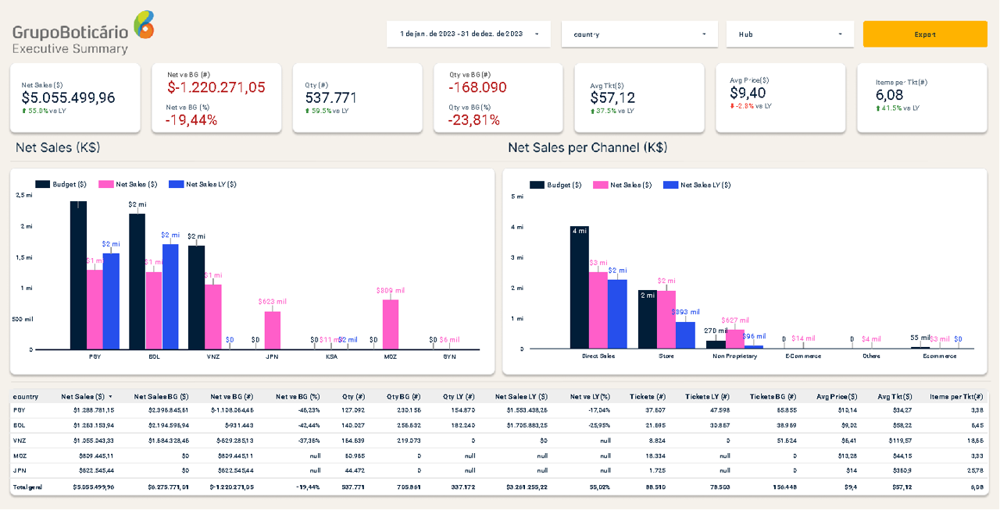

## Channel:
The visualization contains the results of the current year vs the previous year between the channels and the name of the channels. The report is 100% integrated with the period filter.

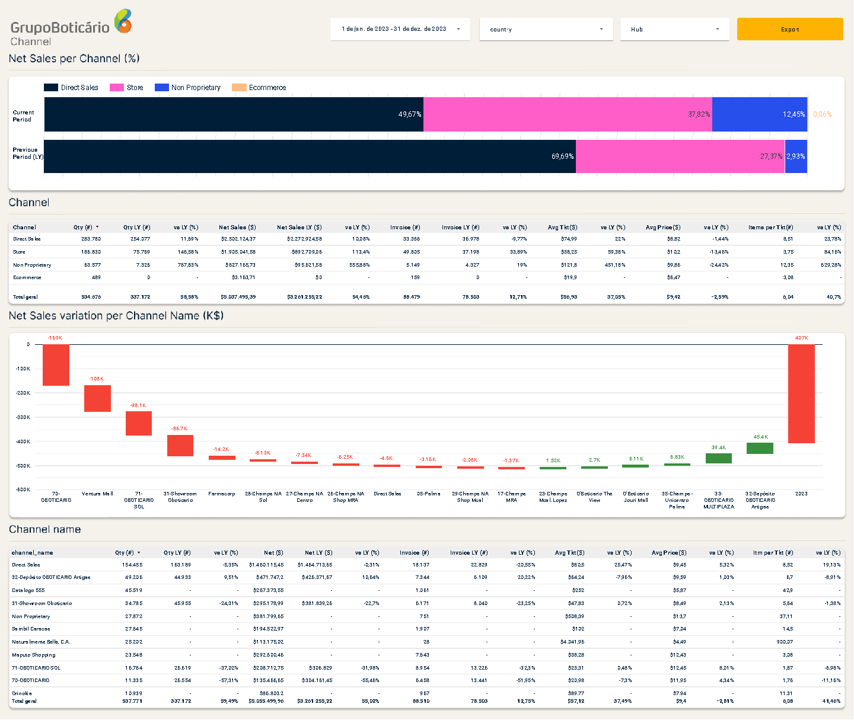

## Store:
The visualization contains the results of the current year vs the previous year and the budget of the "Store" Channel. The report is 100% integrated with the period filter.

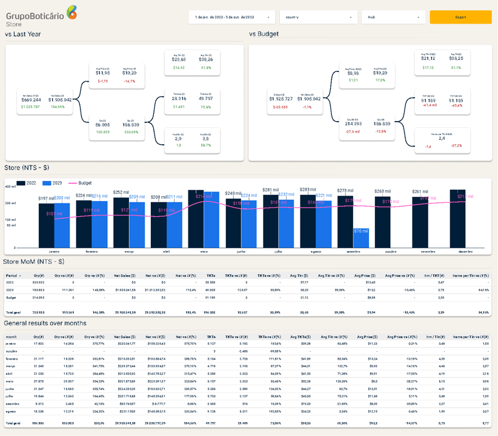

## VD:
The visualization contains the results of the current year vs the previous year of the "Direct Sales" Channel. The report is 100% integrated with the period filter.

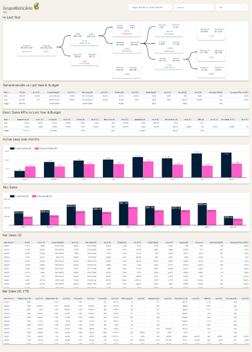

## VD Budget:
The visualization contains the results of the current year vs the budget  of the "Direct Sales" Channel. The report is 100% integrated with the period filter.

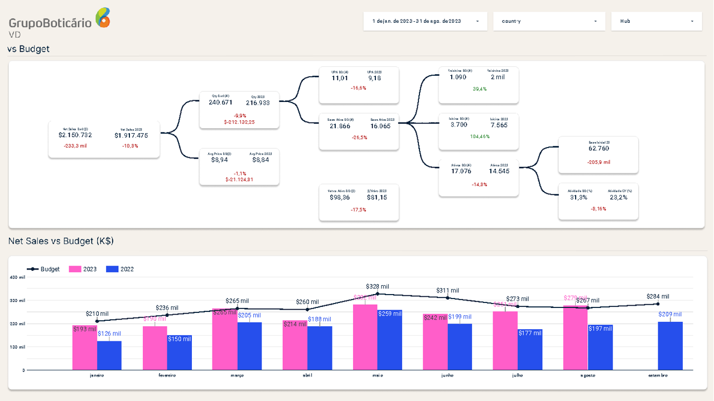

## Categories:
The visualization contains the results of the current year vs the previous year by categories. The report is 100% integrated with the period filter.

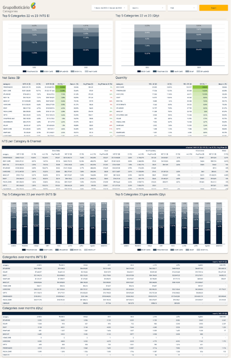

## Brand:
The visualization contains the results of the current year vs the previous year by brand. The report is 100% integrated with the period filter.

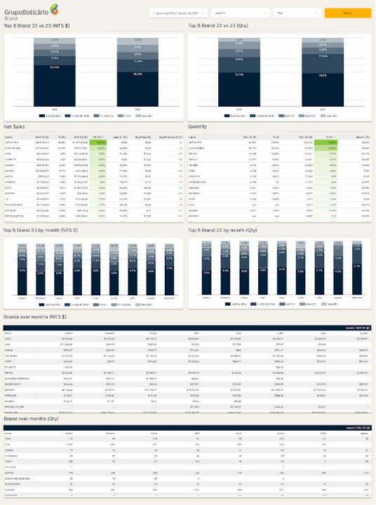

## SKU:
The visualization contains the results of the current period by Sku Key (Chave). The report is 100% integrated with the period filter.

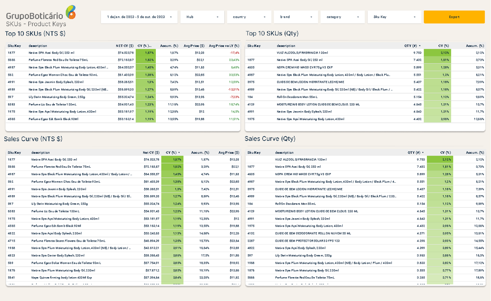

## Lines:
The visualization contains the results of the current period by Lines. The report is 100% integrated with the period filter.

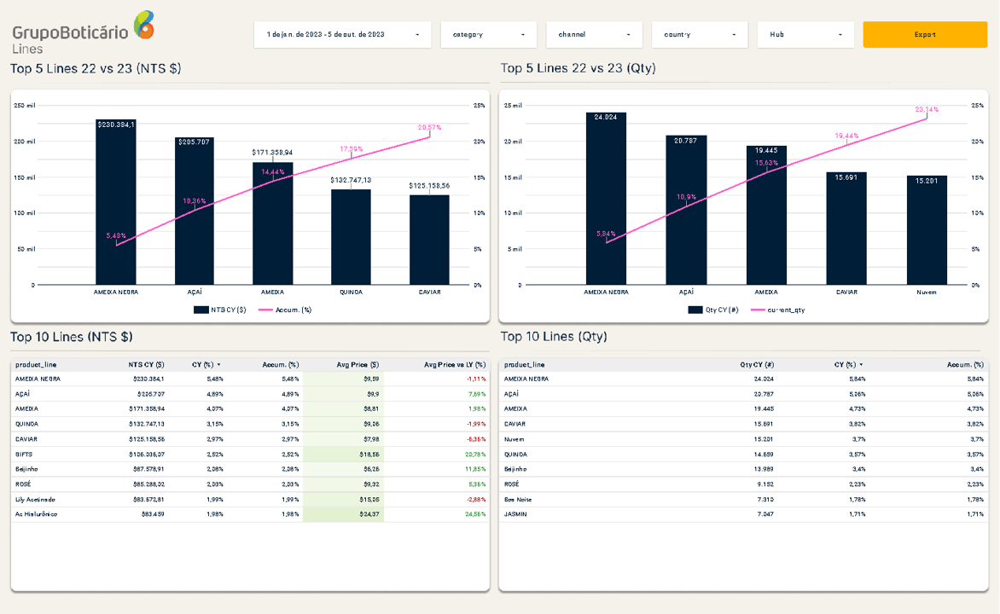

# Thanks

This was one of the projects delivered to/with Grupo Boticário. If you have any questions or suggestions, contact me via LinkedIn.