# SellOut International - Data Processing to Global Partners (EN-US)

## ℹ️ Disclaimer
**PT-BR**:
Este documento contém scripts em Python e consultas do BigQuery utilizados no projeto. Todos os exemplos, códigos e consultas são puramente ilustrativos e destinam-se apenas a fins de documentação. Qualquer semelhança com dados reais é puramente coincidência.

Por favor, note que o acesso aos sistemas e dados reais requer autorização e concessão de acesso específica. Não é permitido o acesso não autorizado ou o uso não autorizado de quaisquer informações ou sistemas.

**EN-US:**
This document contains Python scripts and BigQuery queries used in the project. All examples, code snippets, and queries are purely illustrative and intended for documentation purposes only. Any resemblance to real data is purely coincidental.

Please note that access to actual systems and data requires specific authorization and access grants. Unauthorized access or unauthorized use of any information or systems is strictly prohibited.

**ES-CO:**
Este documento contiene scripts de Python y consultas de BigQuery utilizadas en el proyecto. Todos los ejemplos, fragmentos de código y consultas son puramente ilustrativos y están destinados únicamente a fines de documentación. Cualquier parecido con datos reales es pura coincidencia.

Por favor, tenga en cuenta que el acceso a sistemas y datos reales requiere autorización específica y concesiones de acceso. El acceso no autorizado o el uso no autorizado de cualquier información o sistemas está estrictamente prohibido.

# 🎯 Project Objectives

Improve SellOut data processing for LATAM countries and later for others, ensuring efficient updating, data security, low processing costs and effective visualization of results.

# 🗒️ General Vision

**Sponsors:** Felipe Sartori, Matthieu Battard

**Manager:** [Andre Waleczki](https://www.linkedin.com/in/andre-waleczki/)

**Start date:** 04/09/2023

**Deadline executed:** 05/10/2023

**Technology used:** *Excel Files, Google Colab, Google Drive, Google Sheets, Google BigQuery, DataPrep by Trifacta and Looker Studio.*

# 📋 Project Architecture:

The entire project was carried out using pre-existing data processing structures, we organized new folders as the source of the files and created a new Python script that queries some Big Query tables and overwrites the processed data in a table from project ssbx-hidden-information' and a migration to the 'ssbx-hidden-information2' project is planned. Below is the initial project diagram:

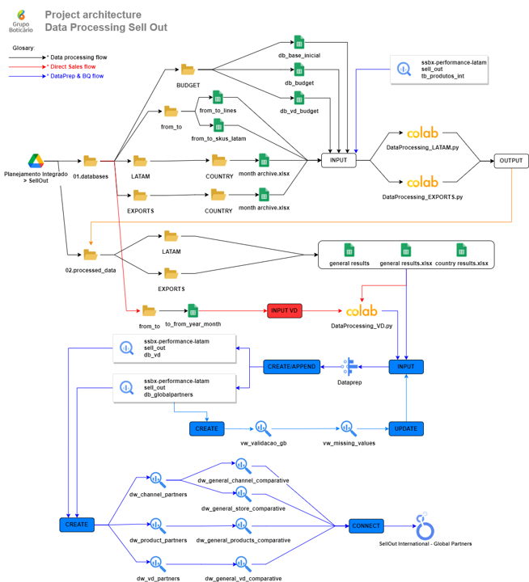

# ☑️ Requirements

* Users who will run the script: Must have access and have accessed at least once all the files that are consumed by the script. Replace the current month's file in the "Historic" folder for each country.

* Users who will consume the data in Looker: Must have reader access to the BigQuery table for the data to be loaded.

# Execution suggestion:
Run only after allocating the files correctly in the folders and processing step by step as explained below.

## Automation Flow - Sell Out:
To run the following script, the files for the month in which you will update the data must be in the destination folder for each country as in the example below:

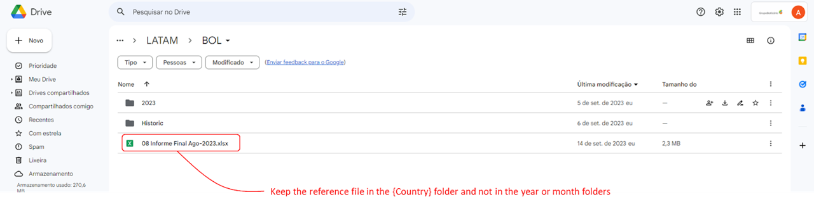

* The file name **does not matter** as long as it is in the correct destination (the same applies for all countries)

The *DataProcessing_LATAM.py* and *DataProcessing_EXPORTS.py* scripts read the files shown in the diagram, perform the necessary data processing to standardize data from different countries and clean up null or non-existent data, keeping only the table pattern defined for data loading from Dataprep/ BigQuery and stores the results directly in the Google Sheets files below:

* **general_results_LATAM**

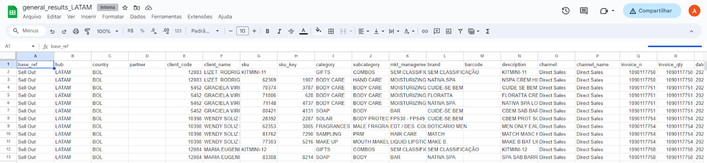

* **general_results_EXPORTS**

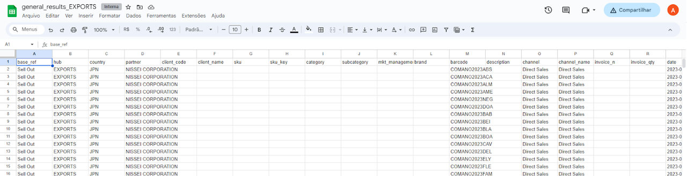

and after that, run the Dataprep Global Partners import service to export data from the Google Sheets file directly to the BigQuery table `ssbx-hidden-information.sell_out.db_globalpartners`. 

* **Dataprep** Global Partners: Dataprep is configured to convert the Excel column type to the acceptable BigQuery format and import it into the reference or creation table if it does not exist.

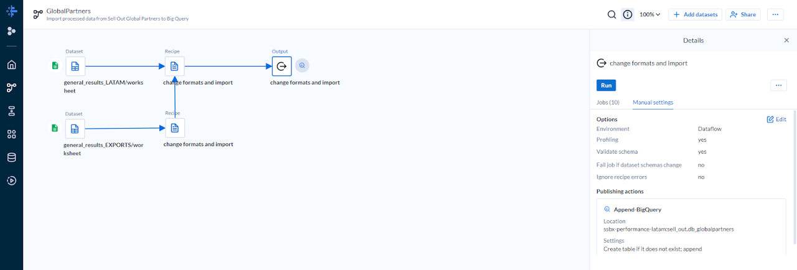

*You need to right click on dataset and click on refresh to update the file in dataprep*

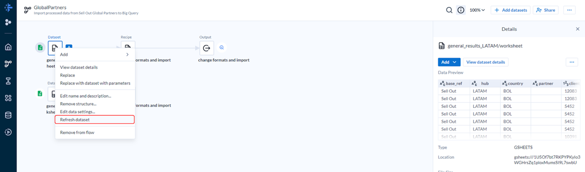

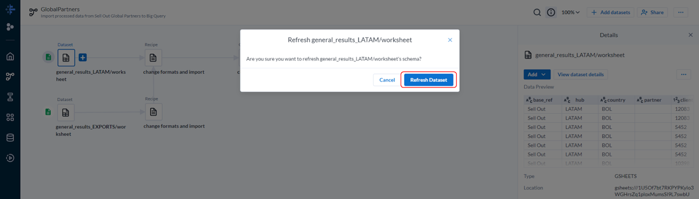

Click  to import data to BigQuery.

* **BigQuery** Table: Here we maintain the history and the base consumed by the views to bring the updated data to the Dashboard.

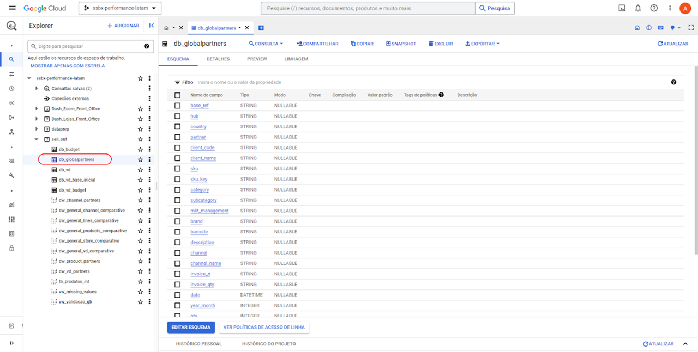

With the updated BigQuery table, the SQL views related to the table are automatically updated with newer data, and this in turn is reflected in the **General Results Dashboard - Global Partners**

## Important information
As the months and years go by, it is common for some channels, categories, etc. to have changes or discontinuations. However, in our views, we consume comparisons comparing the relevant indicators to the Dashboard views, and despite having the previous year's data in the base, they are not included in the annual comparisons. So that we do not see missing data under any circumstances, the views *vw_validacao_gb* and *vw_missing_values* were created.

After updating the current month's data, run the process in **Dataprep Missing Comparative - Global Partners** to import a data mirror that has results from the previous year, but which does not continue in the current year, so that the results are added together and we do not lose visibility of the results:

* **Missing Comparative - Global Partners**

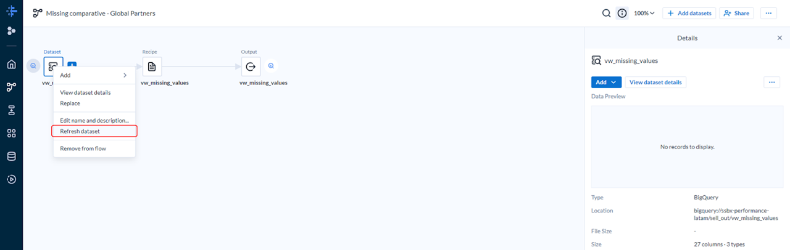

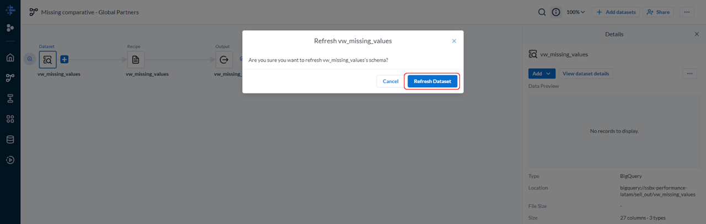

Click  to import data to BigQuery.

## Automation Flow - Direct Sales:

With the Sell Out automation process updated, we can run the script *DataProcessing_VD.py* which crosses the historical base of the month desired from `ssbx-hidden-information.sell_out.db_globalpartners` for updating and updates its status according to the business rules established in the Script, after execution the results are exported to a Google Sheets file below:

* **general_results_VD**

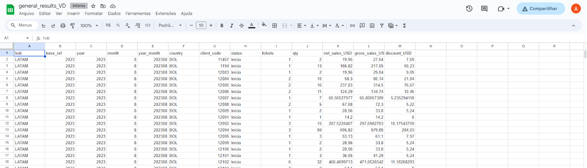

and after that, run the Dataprep VD import service to export data from the Google Sheets file directly to the BigQuery table `ssbx-hidden-information.sell_out.db_vd`. 

* **Dataprep VD**: Dataprep is configured to convert the Excel column type to the acceptable BigQuery format and import it into the reference or creation table if it does not exist.

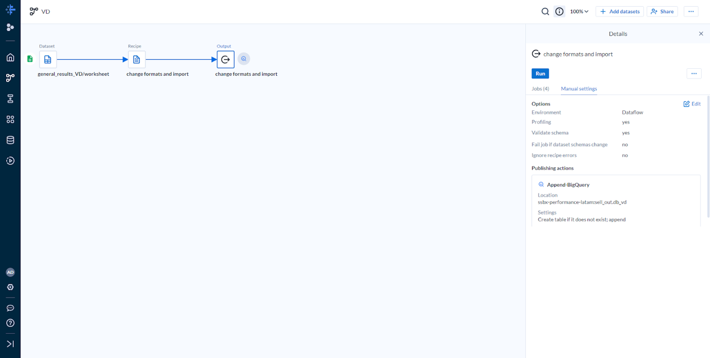

*You need to right click on dataset and click on refresh to update the file in dataprep

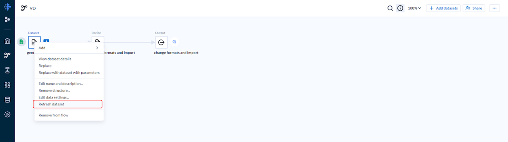

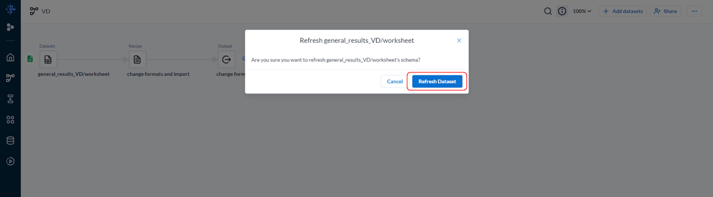

Click  to import data to BigQuery.

* **BigQuery Table VD**: Here we maintain the history and the base consumed by the views to bring the updated data to the Dashboard.

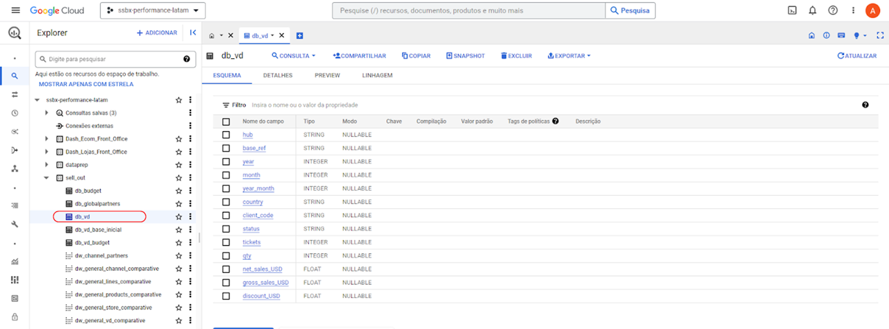

With the updated BigQuery table, the SQL views related to the table are automatically updated with newer data, and this in turn is reflected in the **General Results Dashboard - Global Partners**

# Maintenance and Support:

The errors expected for future executions are the non-previous change of layout, format and column names of the files used as references in the code. If the code does not execute correctly, the remaining import and export steps through **DataPrep** and **Google BigQuery** are not executed. Be careful if you encounter any errors while executing the script.

# In Case of Errors:
**We only have three possibilities**: *Invalid data*, *changing the name of the columns* or *changing the name of the spreadsheet*. The file name is obtained automatically through the Script but we are unable to do the same with the spreadsheet name.

In addition to the errors mentioned above, we have a problem in relation to comparisons in views, if the current *year_month* has a reference to parents, hub, channel, channel_name, category, brand that exists in the previous year, but not in the current year (or vice and verse) the data is not included in results comparisons. That's why we created the views *vw_missing_value*s and *vw_validacao_gb*, which validates these missing values that will generate problems in comparisons and aggregates them in the *db_global_partners* format through DataPrep

# Tables:
### db_global_partners

Table that stores the raw data processed only with SKU and rename crossings in the columns of the files received by partners in each country. It is also the reference for all stages of the project in relation to output.

#### Schema

| fullname | type | description |
|---------:|-----:|------------:|
| base_ref | STRING | Reference of the year |
| hub | STRING | Hub reference which is a country location |
| country | STRING | Country reference |
| partner | STRING | Partner name |
| client_code | STRING | Customer code |
| client_name | STRING | Client name |
| sku | STRING | SKU code |
| sku_key | STRING | Key Code |
| category | STRING | Category name |
| subcategory | STRING | Subcategory name |
| mkt_management | STRING | Brand Management |
| brand | STRING | Brand name |
| barcode | STRING | Barcode |
| description | STRING | Product Description |
| channel | STRING | Sales channel |
| channel_name | STRING | Channel name |
| invoice_n | STRING | Sales code |
| invoice_qty | STRING | Sales count |
| date | DATETIME | Date |
| year_month | INTEGER | Reference of the year & month merge |
| qty | INTEGER | Sales quantity |
| discount_USD | FLOAT | Discount applied |
| gross_sales_USD | FLOAT | Gross sales |
| net_sales_USD | FLOAT | Liquid sales |
| product_line | STRING | Olfactory product line |
| director_code | STRING | Director's code |
| director_name | STRING | Director's name |

### db_vd

Table that stores the processed Direct Sales data on a monthly basis, the script searches the previous month's results directly in this table, comparing with the current month's results in the db_global_partners table and updating the sellers' status according to the current month's results.

#### Schema

| fullname | type | description |
|---------:|-----:|------------:|
| hub | STRING | Hub reference which is a country location |
| base_ref | STRING | Reference of the year |
| year | INTEGER | Reference of the year |
| month | INTEGER | Reference of the month |
| year_month | INTEGER | Reference of the year & month merge |
| country | STRING | Country reference |
| client_code | STRING | Customer code |
| status | STRING | Partner status for the month |
| tickets | INTEGER | Count of sales |
| qty | INTEGER | Count of products selled |
| net_sales_USD | FLOAT | Liquid sales |
| gross_sales_USD | FLOAT | Gross sales |
| discount_USD | FLOAT | Discount applied |

### db_budget

Table replicated from a Google Sheets file, which contains Budget data by country and channel for Sell Out. As it is an integrated file, any layout change in the Google Sheets file may result in errors in the table, only updating is recommended incremental goals and in case of layout changes, reimporting the table is recommended.

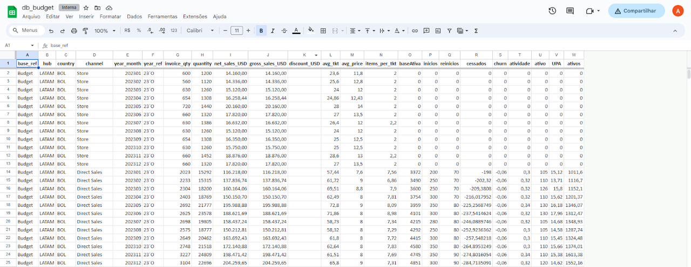

### db_vd_base_inicial

Table replicated from a Google Sheets file, which contains initial baseline data by country and month for VD. As it is an integrated file, any layout change in the Google Sheets file may result in errors in the table, only updating is recommended for incremental purposes and in case of layout changes it is recommended to reimport the table.

* The file is integrated with a connection via Query in the db_vd table to obtain the number of assets, starts and restarts and calculate the initial base in the file itself. In yellow are the columns that are imported into BigQuery.


### db_vd_budget

Table replicated from a Google Sheets file, which contains Budget data by country for VD. As it is an integrated file, any layout change in the Google Sheets file may result in errors in the table, only updating is recommended incremental goals and in case of layout changes, reimporting the table is recommended.

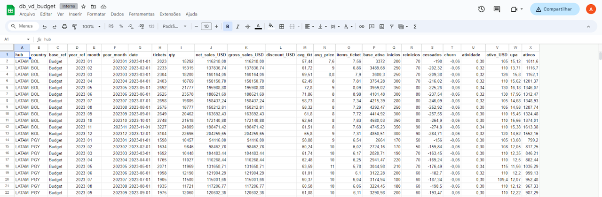

## Query

### base_inicial

To obtain the initial base data and calculate the monthly accumulations by country, we use a Google Sheets file called db_base_initial, which runs the query below in dw_vd_partners to obtain the count of starts, restarts, stops and calculates the net addition.

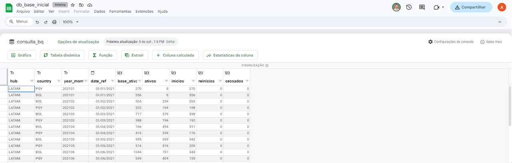

```sql
select 
bvd.hub,
bvd.country,
bvd.year_month,
bvd.date_ref,
count(case when bvd.status in ('A0','Início','Reinício') then 1 else null end) as base_ativa,
count(case when bvd.status in ('A0') then 1 else null end) as ativos,
count(case when bvd.status in ('Início') then 1 else null end) as inicios,
count(case when bvd.status in ('Reinício') then 1 else null end) as reinicios,
count(case when bvd.status in ('Cessado') then 1 else null end) as cessados
from ssbx-hidden-information.sell_out.dw_vd_partners as bvd
group by bvd.hub, bvd.country, bvd.year_month, bvd.date_ref
```